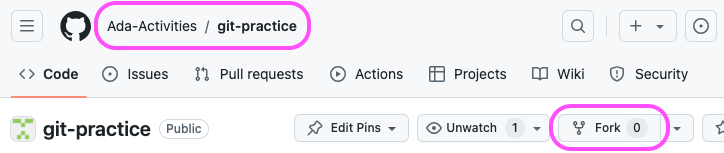
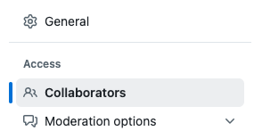
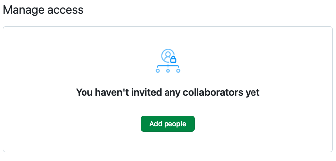
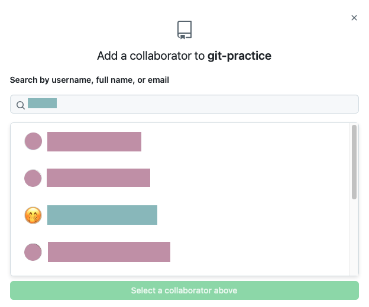
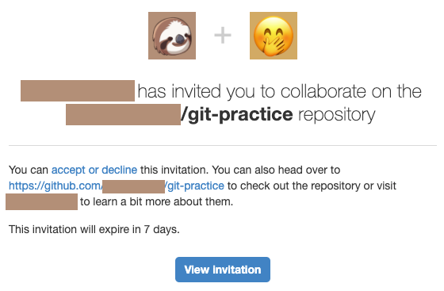
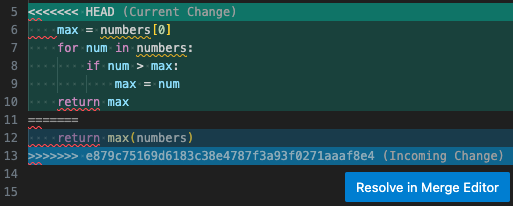

# Activity: Using Git to Collaborate

## Goal

Previously we examined how you can use git to save our work progress by making commits saving changes to our code. This has allowed us to back up our work in incremental changes both locally and on GitHub. Now we will use git and GitHub to collaborate remotely.

## Things to Remember

- **Communicate** as a team on Zoom, ask each other for help
  - Remember you can share your screen to get help or demonstrate for your teammates.
- Ask for help via Slack, if needed, so your instructor can know to jump in and assist

## Before Getting Started

Just to make sure that VS Code is set as the default editor for git commit messages, execute this command in the terminal:

```bash
$ git config --global core.editor "code --wait"
```

### Set Up the Repository

_Please note that the actual GitHub UI may have changed since these screenshots were taken. If you don't see the exact same thing, look for something similar._

We will form into teams of 3 or 4 students. **One** partner will fork and clone this repository.

1. To fork the repository, verify that you are on the **Ada-Activities** repository, and click on the **Fork** button.



2. Go to the **Settings** in the options towards the top of the page (it may be necessary to enlarge your browser window to to the Settings option), then **Collaborators**.




3. Add your teammates as collaborators






1. Each team member will get an email inviting them to the repository. They should click View Invitation and accept the invitation.



### Clone the Repository

Each team member should clone (DO NOT fork) the repository to their local computer using:

```
$ git clone <URL>
```

Make sure you are cloning your **partner's** repository and **not** Ada's.

If you `cd` into the repository and type `git remote -v` you should see your partner's repo and **NOT** Ada-Activities.

## Activity Instructions

### Step 1: Complete a Function

Each team member, A, B, C (and maybe a 4th) will complete **one** of the following functions and then add and commit the file.

So one teammate will fill in the body of the function in `function_a.py` and another will complete the body of the function in `function_b.py`, etc.

**function_a.py**

```python
def most_common_value(number_list):
    """ returns the most common element of the list
    """
    frequency_index = {}
    max_frequency = -1
    most_common_value = None
    for num in number_list:
        if frequency_index.get(num):
            frequency_index[num] += 1
        else:
            frequency_index[num] = 1

        if max_frequency < frequency_index[num]:
            max_frequency = frequency_index[num]
            most_common_value = num

    return most_common_value
```

**function_b.py**

```python
def silly_sum():
    """ reads numbers from the user
        summing as we go until either
        the user enters 0, or
        the sum reaches or exceeds 1000
    """
    num = int(input('Please enter a number => '))
    sum = 0

    while num != 0:
        sum += num
        if sum >= 1000:
            break

        num = int(input('Please enter a number => '))

    return sum
```

**function_c.py**

```python
def merge_lists(list_a, list_b):
    """ Returns a new list which is
        a combination of list_a and list_b
        without any duplicate elements.
    """
    return list(set(list_a) | set(list_b))
```

**Teams with Four Members**

If you have a 4th team member, they should NOT complete `function_d.py`, since this is used to experiment with merge conflicts in the next step. Instead, they should add a completely new file to the repository by making a copy of `function_a.py`, renamed to `function_e.py`. They should then complete the function in `function_e.py` the same way as the team member who completed `function_a.py`.

### Step 2: Add and Commit Your Function

Each team member should should add and commit their work.

```
$ git add <filename>
$ git commit -m "<COMMIT MESSAGE>"
```

This stages changes and saves the changes as a commit. Use meaningful commit messages.

### Step 3: Push Changes to GitHub

Each team member should try to send their changes to GitHub.

```
$ git push
```

**🚨 Oh Snap! 🚨** One or more team members should get this message!

```
$ git push
To github.com:<GIT-USERNAME>/git-practice.git
 ! [rejected]        main -> main (fetch first)
error: failed to push some refs to 'github.com:<GIT-USERNAME>/git-practice.git'<GIT-USERNAME>
hint: Updates were rejected because the remote contains work that you do
hint: not have locally. This is usually caused by another repository pushing
hint: to the same ref. You may want to first integrate the remote changes
hint: (e.g., 'git pull ...') before pushing again.
hint: See the 'Note about fast-forwards' in 'git push --help' for details.
```

This is because GitHub has commits not available locally. One partner managed to push their commits before the other(s).

GitHub will not let the rest of the team push changes until they have merged their git history with what is already on GitHub.

### Step 4: Team Members Unable to Push Should Pull

Each team member who was unable to push to GitHub should instead **pull** the changes which are on GitHub, but not available locally.

_Notice we are following the directions git provided above._

```
$ git pull
```

The git command should open an editor with a default merge message. Close the editor window that it opened, and the command will complete.

If the merge message file doesn't open in VS Code, our git may be missing a configuration value. If VS Code wasn't configured as the git editor, we'll usually see the commit message file open directly in our terminal. In that case, close the entire terminal, and open a new one. Navigate back to your project directory and run
```bash
git config --global core.editor "code --wait"
```
to fix this. Then try to `git pull` again.


>`git pull` is doing two things. First it retrieves information about what commits are in the remote repository. Then it tries to merge those changes into the local repository. If we had pulled before committing, git would have been able to bring down the changes directly without additional intervention on our part. However, since we all committed before trying to pull, git needs to do some bookkeeping. It records a local merge commit message, but allows us to edit the message ourselves if we would like!

Notice that at this point, we did not have any merge conflicts. Git will _always_ prevent pushes if the remote repository has commits that are not in the local repository, even if they do not conflict.

After pulling changes from GitHub verify that the local repository matches GitHub. Then each remaining teammate should push their changes to GitHub.

```
$ git push
```

Groups of 3 will have one teammate repeat this step until everyone's function is on GitHub.

### Step 5: Working on the Same Function

What if multiple people write code on the same area of the same file?

Each team member should complete the function in `function_d.py`. Each team member should write their own solution.

Then add, commit, and push changes to GitHub using the same steps as above. Remember to `git pull` if an error is encountered while pushing.

At least one team member should get the following message.

```
$ git pull
 * branch            main       -> FETCH_HEAD
Auto-merging README.md
CONFLICT (content): Merge conflict in function_d.py
Automatic merge failed; fix conflicts and then commit the result.
```

This message occurs when git does not understand how to combine the changes. This situation is called a **merge conflict**. When you look at the code in VS Code it should look something like this.



### Step 6: Using Zoom Screen Sharing, Resolve the Conflict

There are a number of ways we could resolve this conflict.

We could use the actions displayed above the conflicting region to resolve the conflict. VS Code calls such actions displayed near code, but which aren't a part of the code, Code Lens. The Code Lens actions can work well for the simple cases shown here:
- **Accept Current Change** - Keeps the portion of the code marked `(Current Change)` and discards the other code and the conflict markers.
- **Accept Incoming Change** - Keeps the portion of the code marked `(Incoming Change)` and discards the other code and the conflict markers.
- **Accept Both Changes** - Keeps both changes, only removing the conflict markers.

The final option, `Compare Changes`, changes the view so that we can see the conflicting code side by side, which can make it easier to compare the changes.

After using the Code Lens actions to resolve the conflict, we must still add any files that had conflicts, and then make a commit. But don't do this until after validating the code changes and any tests that might exist in the project.

Another way to resolve a conflict is to use `Resolve in Merge Editor` option. This will take us to a view where the conflicting code appears side by side, along with a third pane showing the result of our resolution. Similar actions to the Code Lens actions are available in this view, and the bottom merged view is also directly editable. Get the code to look how you want it to look, then click `Complete Merge`.

Each file with a merge conflict must be resolved. Once we've finished them all, we'll only need to commit a change to complete the merge. No adding is required. Again, be sure to validate the code changes and any tests that might exist in the project first.

Keep in mind when using tools to help us with resolving a merge conflict, that neither git nor VS Code understand the intent of our code, so it's up to us to understand what the code was supposed to do and how to combine the changes.

Finally, we can edit the file to merge the code ourselves, deleting and combining as necessary. Git really does add the lines beginning with `<<<<<<<`, `=======`, and `>>>>>>>` into the file when a merge conflict occurs, so if we resolve the changes manually, we must be sure to remove those lines from the file ourselves.

After resolving the merge conflict, test the function by running the file before moving on.

```
python function_d.py
```

### Step 7: Add and Commit the Resolution to the Merge Conflict

The team member who resolved the conflict can then add and commit the file and push the changes to GitHub.

For commits that are the result of resolving a merge conflict, git can generate a commit message for us, so there's no need to come up with one ourselves.

By running `git commit` without the message (`-m`) arguments, it will auto-populate a message, and open it in our editor to allow us to make changes. Just close the message file, and git will complete the commit.

If the commit message file doesn't open in VS Code, our git may be missing a configuration value. If VS Code wasn't configured as the git editor, we'll usually see the commit message file open directly in our terminal. In that case, close the entire terminal, and open a new one. Navigate back to your project directory and run
```bash
git config --global core.editor "code --wait"
```
to fix this. Then try to `git commit` again.

### Step 8: Everyone Pull the Current Remote Repository

Lastly every team member should run `git pull` to retrieve the remote repository to their computer and verify that they have the same code on their computer.

### Step 9: Experiment!

Now is the time to break all the things!

What kinds of things can we try? There's nothing we need to worry about breaking in this repository, so try lots of things and see what happens. Try to make note of any error messages, and research anything that feels unfamiliar. Can you get stuck in the middle of a merge? How can we get out of it if we do? If you get stuck, ask for help and we'll try to get you back on track.

Try to make various changes and see what happens. Try to predict whether certain changes will cause conflicts or not. Experiment with the order of pushing and pulling to see what happens. If two people in the group make changes, what happens with the third person if they regularly update their local repository compared to if they wait to update their local repository until all the changes have been made? What happens if we try to pull but have changes that are unstaged or staged but not committed?

There are lots of combinations of things to try, and ways that git will respond to them. The more we experiment, the more we'll understand how git works and how to use it effectively. A "sandbox" repository like this one is a great place to try things out and see what happens!

## Questions to Answer

- How do git and GitHub allow us to collaborate on a project?
- What is a _merge conflict_?
